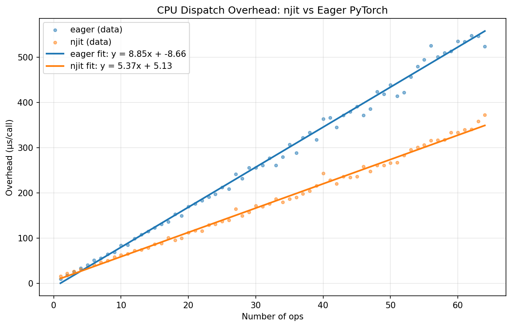

# Eager vs njit: CPU Dispatch Overhead

Measures wall-clock time of launching GPU ops through `numba.njit` vs plain
eager PyTorch.  All tensors are tiny (4×4) so GPU compute is negligible — only
the CPU dispatch overhead is measured.  No `cudaDeviceSynchronize` is called.

Each graph is simply `for i in range(N): x = torch.relu(x)`.

## Results



### Linear fit: `y = k * x + b`

|       | k (µs/op) | b (µs)  |
|-------|-----------|---------|
| njit  | 5.3709    | 5.1297  |
| eager | 8.8468    | -8.6629  |

- **k** (slope) is the **per-op cost** — the marginal time (in µs) added by
  each additional `torch.relu` call.  A smaller *k* means each op dispatches
  faster.
- **b** (intercept) is the **fixed overhead** — the baseline time (in µs) for
  entering and leaving the function, independent of how many ops it contains.
  This captures things like the Python → njit transition cost or the eager
  Python function-call overhead.

### Raw data

| Ops | njit (µs) | eager (µs) |
|-----|-----------|------------|
| 1 | 15.37 | 9.63 |
| 2 | 21.61 | 17.53 |
| 3 | 26.56 | 25.72 |
| 4 | 31.13 | 33.65 |
| 5 | 35.54 | 40.21 |
| 6 | 41.01 | 51.05 |
| 7 | 46.47 | 55.94 |
| 8 | 50.67 | 64.38 |
| 9 | 57.85 | 69.07 |
| 10 | 62.57 | 83.62 |
| 11 | 65.23 | 84.66 |
| 12 | 72.11 | 98.97 |
| 13 | 73.99 | 107.71 |
| 14 | 78.68 | 115.07 |
| 15 | 86.11 | 123.05 |
| 16 | 88.19 | 131.12 |
| 17 | 100.74 | 136.01 |
| 18 | 95.26 | 152.48 |
| 19 | 99.81 | 149.29 |
| 20 | 112.20 | 169.50 |
| 21 | 116.59 | 175.68 |
| 22 | 115.78 | 183.04 |
| 23 | 128.68 | 190.56 |
| 24 | 130.85 | 196.84 |
| 25 | 136.58 | 211.70 |
| 26 | 139.50 | 208.72 |
| 27 | 164.47 | 241.40 |
| 28 | 149.44 | 231.97 |
| 29 | 157.10 | 255.55 |
| 30 | 171.06 | 255.26 |
| 31 | 169.94 | 260.65 |
| 32 | 175.93 | 276.45 |
| 33 | 186.79 | 261.03 |
| 34 | 179.82 | 279.01 |
| 35 | 186.28 | 307.03 |
| 36 | 189.79 | 287.83 |
| 37 | 197.66 | 321.56 |
| 38 | 204.49 | 333.54 |
| 39 | 216.12 | 317.47 |
| 40 | 243.54 | 363.65 |
| 41 | 227.78 | 365.82 |
| 42 | 220.32 | 344.75 |
| 43 | 236.07 | 371.08 |
| 44 | 233.87 | 379.05 |
| 45 | 235.90 | 391.18 |
| 46 | 258.34 | 371.40 |
| 47 | 247.30 | 385.88 |
| 48 | 260.91 | 423.18 |
| 49 | 260.67 | 418.03 |
| 50 | 265.86 | 438.57 |
| 51 | 266.95 | 414.02 |
| 52 | 283.06 | 421.41 |
| 53 | 295.62 | 456.16 |
| 54 | 300.68 | 479.08 |
| 55 | 306.07 | 494.00 |
| 56 | 315.31 | 525.26 |
| 57 | 316.37 | 500.42 |
| 58 | 317.58 | 509.27 |
| 59 | 333.66 | 512.75 |
| 60 | 333.03 | 535.16 |
| 61 | 339.26 | 534.12 |
| 62 | 340.18 | 547.64 |
| 63 | 358.14 | 546.68 |
| 64 | 372.63 | 523.15 |

> 1000 iterations per data point, 50 warmup iterations.

## Benchmark environment

| Component | Details |
|-----------|---------|
| CPU | aarch64 |
| GPU | NVIDIA GB200 |
| CUDA | 13.2 |
| Driver | 580.65.06 |
| Python | 3.12.3 |
| PyTorch | 2.11.0a0+a6c236b9fd.nvinternal.main.45821058 |
| Numba | 0.64.0 |
| OS | Linux-6.14.0-1007-nvidia-64k-aarch64-with-glibc2.39 |

## Running

```bash
PYTHONPATH=src python benchmarks/eager-vs-njit/run.py
```
