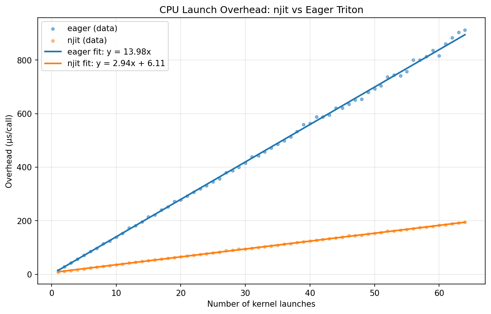

# Triton vs njit: CPU Launch Overhead

Measures wall-clock time of launching Triton kernels through `numba.njit` vs
the standard Python Triton launch path.  All tensors are tiny (1024 elements)
so GPU compute is negligible — only the CPU launch overhead is measured.
No `cudaDeviceSynchronize` is called.

Each benchmark simply calls `add_kernel` N times.

## Results



### Linear fit (outliers removed, 2σ threshold)

|       | model     | k (µs/launch) | b (µs)  |
|-------|-----------|----------------|---------|
| njit  | y = kx+b  | 2.9426         | 6.1052  |
| eager | y = kx    | 13.9844         | 0 (forced) |

- **k** (slope) is the **per-launch cost** — the marginal time (in µs) added
  by each additional Triton kernel launch.
- **b** (intercept) is the **fixed overhead** — the baseline time (in µs) for
  entering and leaving the function, independent of how many kernels are
  launched.

### Raw data

| Launches | njit (µs) | eager (µs) |
|----------|-----------|------------|
| 1 | 8.54 | 14.13 |
| 2 | 11.45 | 28.39 |
| 3 | 14.35 | 42.33 |
| 4 | 17.26 | 56.95 |
| 5 | 20.03 | 70.92 |
| 6 | 23.17 | 85.28 |
| 7 | 26.85 | 96.79 |
| 8 | 29.98 | 114.75 |
| 9 | 32.97 | 124.86 |
| 10 | 35.81 | 138.62 |
| 11 | 38.80 | 152.69 |
| 12 | 41.88 | 173.20 |
| 13 | 44.88 | 181.19 |
| 14 | 47.73 | 195.87 |
| 15 | 51.08 | 214.84 |
| 16 | 53.94 | 222.57 |
| 17 | 56.08 | 240.44 |
| 18 | 58.97 | 252.00 |
| 19 | 62.17 | 272.69 |
| 20 | 65.05 | 277.30 |
| 21 | 67.80 | 291.85 |
| 22 | 70.87 | 306.87 |
| 23 | 74.04 | 320.22 |
| 24 | 76.81 | 330.84 |
| 25 | 79.83 | 345.79 |
| 26 | 82.23 | 357.52 |
| 27 | 88.02 | 380.56 |
| 28 | 90.48 | 387.12 |
| 29 | 93.59 | 400.25 |
| 30 | 93.86 | 415.49 |
| 31 | 97.65 | 439.37 |
| 32 | 100.13 | 442.37 |
| 33 | 103.40 | 457.62 |
| 34 | 106.11 | 471.16 |
| 35 | 108.93 | 486.29 |
| 36 | 112.23 | 499.62 |
| 37 | 114.64 | 513.88 |
| 38 | 118.06 | 533.19 |
| 39 | 121.06 | 559.32 |
| 40 | 123.58 | 563.11 |
| 41 | 126.96 | 588.12 |
| 42 | 130.23 | 587.74 |
| 43 | 133.20 | 594.51 |
| 44 | 135.35 | 620.74 |
| 45 | 138.59 | 621.54 |
| 46 | 143.66 | 635.28 |
| 47 | 144.46 | 651.42 |
| 48 | 146.45 | 654.06 |
| 49 | 150.60 | 680.02 |
| 50 | 152.81 | 693.45 |
| 51 | 155.86 | 704.55 |
| 52 | 161.15 | 736.70 |
| 53 | 162.06 | 744.05 |
| 54 | 164.88 | 741.21 |
| 55 | 167.57 | 756.89 |
| 56 | 170.84 | 800.62 |
| 57 | 173.81 | 800.87 |
| 58 | 176.19 | 813.65 |
| 59 | 178.97 | 837.00 |
| 60 | 183.49 | 815.65 |
| 61 | 185.28 | 861.27 |
| 62 | 188.61 | 883.54 |
| 63 | 192.36 | 903.41 |
| 64 | 194.54 | 913.16 |

> 1000 iterations per data point, 50 warmup iterations.

## Benchmark environment

| Component | Details |
|-----------|---------|
| CPU | x86_64 |
| GPU | NVIDIA A100-SXM4-80GB |
| CUDA | 13.2 |
| Driver | 580.105.08 |
| Python | 3.12.3 |
| PyTorch | 2.11.0a0+a6c236b9fd.nvinternal.main.45927840 |
| Numba | 0.64.0 |
| Triton | 3.6.0 |
| OS | Linux-5.15.0-1063-nvidia-x86_64-with-glibc2.39 |

## Running

```bash
PYTHONPATH=src python benchmarks/triton-vs-njit/run.py
```
