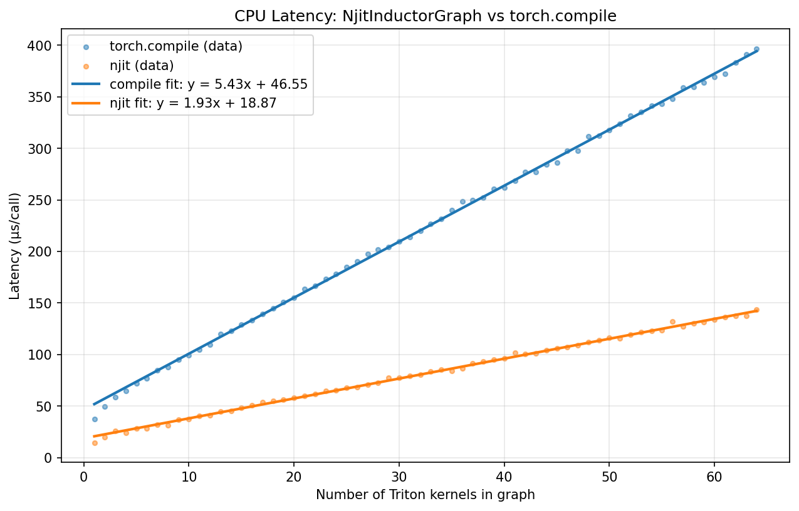

# Reducing Host Latency with `numba.njit` in TorchInductor

**Author:** zasdfgbnm
**Status:** RFC / Proposal
**Target:** PyTorch core / TorchInductor

---

## TL;DR

We present a prototype demonstrating that wrapping TorchInductor's generated orchestration code
with `numba.njit` reduces host-side dispatch latency by **2–5× without changing a single kernel**.
The compiled kernels, the operator semantics, and the overall graph structure are identical to
what Inductor produces today — we only `@njit` the orchestration layer that drives them.

We implemented this idea in the open-source prototype
[zasdfgbnm/njit-wrappers](https://github.com/zasdfgbnm/njit-wrappers). To stress host-side
orchestration rather than kernel time, we benchmark a chain of `torch.softmax` calls (Inductor
emits one Triton kernel per softmax) and report host-side dispatch latency **without**
`cudaDeviceSynchronize`, following the setup in
[benchmarks/inductor-vs-njit](https://github.com/zasdfgbnm/njit-wrappers/tree/main/benchmarks/inductor-vs-njit).
Under these conditions, `@njit` orchestration is **2.8× faster** than `torch.compile`, as
illustrated below.



We propose making Numba an optional dependency of PyTorch and adding a new flag to `torch.compile`:

```python
torch.compile(model, enable_numba=True)
```

When set to `True`, TorchInductor's generated orchestration code is compiled with `numba.njit` instead of being executed as plain Python — reducing host-side dispatch latency with no changes to kernel compilation or the Triton backend. All existing compilation paths are untouched.

---

## Motivation

When the GPU is underutilized — small batch sizes, decode phases, speculative decoding draft
loops — host-side dispatch latency determines end-to-end model throughput. TorchInductor
already supports CUDA Graphs (`reduce-overhead` mode) to address this, but CUDA Graphs impose
hard constraints: static shapes, no host-side computation, no dynamic control flow, no graph
breaks. Real models hit these limits frequently, so CUDA Graphs cannot be enabled
unconditionally. We need an approach that reduces host latency with broader coverage —
applicable to any model regardless of shapes, control flow, or custom ops.

---

## The Proposal and Feasibility Study

### Core idea

TorchInductor's compilation pipeline
([`torch/_inductor/codegen/wrapper.py`](https://github.com/pytorch/pytorch/blob/main/torch/_inductor/codegen/wrapper.py))
generates a Python source file for each compiled model. The heart of that file is a `call(args)`
function — the orchestration runner — that executes on every forward pass. The following is taken
directly from the
[TorchInductor C++ Wrapper Tutorial](https://docs.pytorch.org/tutorials/unstable/inductor_cpp_wrapper_tutorial.html)
in the official PyTorch documentation:

```python
def call(args):
    arg0_1, = args
    args.clear()
    assert_size_stride(arg0_1, (1, ), (1, ))
    with torch.cuda._DeviceGuard(0):
        torch.cuda.set_device(0)
        buf0 = empty_strided((19, ), (1, ), device='cuda', dtype=torch.float32)
        stream0 = get_cuda_stream(0)
        triton_poi_fused_add_lift_fresh_0.run(constant0, arg0_1, buf0, 19,
                                              grid=grid(19), stream=stream0)
        del arg0_1
        return (buf0, )
```

Every time this function is called, CPython pays a cascade of overhead costs:

- **Frame allocation.** A new Python stack frame is pushed and torn down on each call.
- **Buffer allocation via `empty_strided`.** Each call constructs Python tuples for shape
  and stride, resolves keyword arguments, and crosses the Python/C++ boundary into ATen.
- **Grid computation.** `grid(19)` is a Python function call that computes
  `ceil(n / BLOCK_SIZE)`; the result is boxed as a Python integer.
- **Triton's Python launcher.** `triton_poi_fused_add_lift_fresh_0.run(...)` enters
  [`JITFunction.__call__`](https://github.com/triton-lang/triton/blob/main/python/triton/runtime/jit.py),
  which inspects argument types and shapes, selects a specialization, builds a `void*` parameter
  array in Python, and finally crosses into a `ctypes`-wrapped C function to call
  `cuLaunchKernelEx`. That single kernel launch traverses four to six Python frames.

None of this work is intrinsic to dispatching a GPU kernel. It is interpreter bookkeeping. We propose to apply `@numba.njit` directly to the generated `call` function when `enable_numba=True`. Doing so eliminates
all four categories of overhead listed above.

To make this work, PyTorch needs two complementary changes: **(1)** a minor refactor of the generated `call`
function, and **(2)** extension code that plugs into Numba's existing mechanisms so the compiler can lower each
construct to LLVM IR.

The relevant mechanisms are:

**`numba.core.types.Type` + `@typeof_impl`.**
Numba's type system is open to extension. A third-party library can introduce a new compiled
type by subclassing `numba.core.types.Type` and registering a recogniser with `@typeof_impl`.
When a Python object of the corresponding class is passed into a `@njit` function, Numba maps
it to that type — with a chosen machine representation (e.g. a raw pointer stored as `i64`)
— rather than refusing to compile or treating the object as opaque. This makes it possible to
expose arbitrary C/C++ objects that have a Python wrapper (such as tensors or compiled GPU
kernel handles) as first-class values inside JIT-compiled code.

**`@overload`.**
`@numba.extending.overload(fn)` teaches Numba how to compile a call to an existing Python
function `fn` that Numba would otherwise not know how to lower. The decorator is given a
factory function that, for a particular combination of argument types, returns a pure-Python
implementation that Numba can compile. At the call site inside a `@njit` function, Numba
selects the matching overload during type inference and compiles it in place; the original
Python callable is never invoked at runtime. This allows Python-facing library APIs — whose
real work is done in C/C++ — to be given thin compiled implementations that call the
underlying C symbols directly.

**`@intrinsic`.**
`@numba.extending.intrinsic` is an escape hatch that lets an extension author write the
lowering of an operation directly as LLVM IR. It is needed when the correct machine code
cannot be expressed in terms of Python operations that Numba already knows how to compile —
for example, when the target C function uses a calling convention (such as `sret` for
C++ value returns, or a `void**` parameter array as in CUDA launch APIs) that has no natural
Python-level analogue. An `@intrinsic` receives the LLVM `IRBuilder` directly and can emit
arbitrary instructions, making it possible to call any C or CUDA symbol regardless of its
ABI.

### What this is NOT

We are not using Numba to generate GPU kernels. All GPU computation continues to be produced
by Triton (for element-wise and reduction ops) and ATen/cuBLAS (for extern kernels such as
GEMM). Numba is used purely for the *orchestration* layer — the host-side `call(args)` function
that drives the GPU.

### Why `numba.njit` rather than, say, C++?

1. **Pythonic.** The orchestration code stays in Python. It is editable, debuggable, and
   inspectable with standard Python tooling. There is no C++ compilation step at runtime, no
   `ctypes` interop boilerplate, and no ABI concerns.

2. **Lightweight.** The core implementation requires adding `torch.Tensor` and Triton kernel
   objects as first-class types in Numba's type system. This is a well-defined extension point
   in Numba's architecture. It does not require a new compiler or a new IR. Triton kernel
   launching can be supported without any changes to Triton internals, though upstreaming
   first-class Numba support into Triton would be a valuable contribution that benefits the
   broader ecosystem.

3. **Composable with the existing stack.** Numba's `@njit` compiles via LLVM and can call
   arbitrary C symbols. ATen operators are already exposed as stable C++ symbols in
   `libtorch_cpu.so` and `libtorch_cuda.so`. Triton kernels are compiled to PTX/CUBIN and
   launched via `cuLaunchKernelEx`. Both are straightforwardly callable from LLVM IR without
   any Python interpreter involvement.

### Prototype: the `njit-wrappers` repository

To validate feasibility, we built a standalone prototype package —
[zasdfgbnm/njit-wrappers](https://github.com/zasdfgbnm/njit-wrappers) — that implements three
capabilities:

#### 1. `torch.Tensor` inside `@numba.njit` ([source](https://github.com/zasdfgbnm/njit-wrappers/blob/main/src/njit_wrappers/_tensor.py), [benchmark](https://github.com/zasdfgbnm/njit-wrappers/tree/main/benchmarks/eager-vs-njit))

**Study.** Can `torch.Tensor` be made a first-class type in Numba's JIT, such that Python-level
tensor operations compile down to direct ATen C++ calls with no Python interpreter involvement?

<details>
<summary><strong>Experiment design.</strong> Tensor is stored as <code>i64</code> (TensorImpl*); each ATen op is an LLVM intrinsic that spills inputs to the stack and calls the C++ symbol directly — zero Python involvement in the compiled hot path.</summary>

The key insight is that `at::Tensor` is exactly 8 bytes — it contains
only a `TensorImpl*` — so it can be represented inside Numba's compiled code as a plain `i64`.
The Python-to-compiled-code boundary is crossed by two thin C shims (`njit_borrow_impl` and
`njit_wrap_impl`) exported from a small C++ extension. For each ATen operator, its Itanium-mangled
C++ symbol is resolved from `libtorch_cpu.so` at import time and registered with LLVM; Numba
then emits a direct `call` instruction with no Python involvement.

The full path from Python to LLVM IR is:

1. `@typeof_impl` — tells Numba that a `torch.Tensor` Python object has type `TensorType`
2. `@register_model(TensorType)` — tells Numba to represent it as `ir.IntType(64)` (the `TensorImpl*`)
3. `@unbox(TensorType)` — emits `%impl = call i64 @njit_borrow_impl(i8* %pyobj)` to cross the boundary
4. `@intrinsic` per op — emits spill-to-stack + direct ATen call + load result
5. `@box(TensorType)` — emits `%obj = call i8* @njit_wrap_impl(i64 %impl)` on the way back out

ATen's calling conventions (SysV x86-64, `sret` return) are handled by four intrinsic factories:

| Convention | Signature | Ops |
|---|---|---|
| Unary | `void(sret Tensor*, const Tensor&)` | `relu`, `exp`, `log`, `sigmoid`, `tanh`, `silu`, … |
| Binary | `void(sret Tensor*, const Tensor&, const Tensor&)` | `+`, `*`, `/`, `@`, `==`, `<`, … |
| Alpha | `void(sret Tensor*, const Tensor&, const Tensor&, const Scalar&)` | `+`, `-` (with `alpha=1`) |
| Reduction | `void(sret Tensor*, const Tensor&, i16 optional<ScalarType>)` | `sum`, `mean` |

The `sret` slot and every `const Tensor&` argument are stack-allocated `i64` slots; the alpha
case additionally builds a `c10::Scalar(1)` as a 32-byte `[4 x i64]` on the stack.

<details>
<summary>Example: two-layer MLP (Python → generated LLVM IR)</summary>

**Example.** The two-layer MLP from [docs/torch-ops.md](https://github.com/zasdfgbnm/njit-wrappers/blob/main/docs/torch-ops.md):

```python
@numba.njit
def mlp_forward(x, w1, b1, w2, b2):
    """Two-layer MLP: relu(x @ w1 + b1) @ w2 + b2."""
    h = torch.relu(x @ w1 + b1)
    return h @ w2 + b2
```

The core LLVM IR generated for this function (simplified: Numba bookkeeping omitted, faithful
to the actual ATen call patterns):

```llvm
define i8* @mlp_forward(i8* %x_obj, i8* %w1_obj, i8* %b1_obj,
                         i8* %w2_obj, i8* %b2_obj) {
entry:
  ; ── Unbox: borrow TensorImpl* without touching refcount ─────────────
  %x  = call i64 @njit_borrow_impl(i8* %x_obj)
  %w1 = call i64 @njit_borrow_impl(i8* %w1_obj)
  %b1 = call i64 @njit_borrow_impl(i8* %b1_obj)
  %w2 = call i64 @njit_borrow_impl(i8* %w2_obj)
  %b2 = call i64 @njit_borrow_impl(i8* %b2_obj)
  ; njit_borrow_impl resolves to _bridge.cpp: returns TensorImpl* as i64
  ; without touching the refcount — safe because Python keeps the objects alive

  ; ── x @ w1  (_ZN2at4_ops7matmul4callERKNS_6TensorES4_) ──────────────
  %xw1.out = alloca i64
  %x.slot  = alloca i64 ; stack slot IS the at::Tensor (sizeof == 8)
  store i64 %x,  i64* %x.slot
  %w1.slot = alloca i64
  store i64 %w1, i64* %w1.slot
  call void @_aten_matmul(i8* sret bitcast(i64* %xw1.out to i8*),
                            i8*      bitcast(i64* %x.slot  to i8*),
                            i8*      bitcast(i64* %w1.slot to i8*))
  %xw1 = load i64, i64* %xw1.out

  ; ── (x@w1) + b1  (_ZN2at4_ops10add_Tensor4callERKNS_6TensorES4_RKNS_6ScalarE) ─
  %hpre.out = alloca i64
  %xw1.slot = alloca i64
  store i64 %xw1, i64* %xw1.slot
  %b1.slot  = alloca i64
  store i64 %b1,  i64* %b1.slot
  %alpha    = alloca [4 x i64]        ; c10::Scalar(1): {value=1, pad=0, tag=HAS_i, pad=0}
  store i64 1, i64* getelementptr([4 x i64], [4 x i64]* %alpha, i32 0, i32 0)
  store i64 0, i64* getelementptr([4 x i64], [4 x i64]* %alpha, i32 0, i32 1)
  store i64 1, i64* getelementptr([4 x i64], [4 x i64]* %alpha, i32 0, i32 2)
  store i64 0, i64* getelementptr([4 x i64], [4 x i64]* %alpha, i32 0, i32 3)
  call void @_aten_add(i8* sret bitcast(i64* %hpre.out  to i8*),
                        i8*      bitcast(i64* %xw1.slot  to i8*),
                        i8*      bitcast(i64* %b1.slot   to i8*),
                        i8*      bitcast([4 x i64]* %alpha to i8*))
  %hpre = load i64, i64* %hpre.out

  ; ── relu(hpre)  (_ZN2at4_ops4relu4callERKNS_6TensorE) ────────────────
  %h.out    = alloca i64
  %hpre.slot = alloca i64
  store i64 %hpre, i64* %hpre.slot
  call void @_aten_relu(i8* sret bitcast(i64* %h.out    to i8*),
                         i8*      bitcast(i64* %hpre.slot to i8*))
  %h = load i64, i64* %h.out

  ; ── h @ w2  (same pattern as x @ w1) ────────────────────────────────
  ; ...  (identical matmul pattern, omitted for brevity)
  %hw2 = ...

  ; ── (h@w2) + b2  (same pattern as (x@w1) + b1) ──────────────────────
  ; ...
  %result = ...

  ; ── Box: wrap TensorImpl* back into a Python torch.Tensor ────────────
  %ret = call i8* @njit_wrap_impl(i64 %result)
  ret i8* %ret
}

; External declarations resolved from libtorch_cpu.so at import time:
declare void @_aten_matmul(i8* sret, i8*, i8*)
  ; → _ZN2at4_ops7matmul4callERKNS_6TensorES4_
declare void @_aten_add(i8* sret, i8*, i8*, i8*)
  ; → _ZN2at4_ops10add_Tensor4callERKNS_6TensorES4_RKNS_6ScalarE
declare void @_aten_relu(i8* sret, i8*)
  ; → _ZN2at4_ops4relu4callERKNS_6TensorE
declare i64  @njit_borrow_impl(i8*)   ; _bridge.cpp
declare i8*  @njit_wrap_impl(i64)     ; _bridge.cpp
```

</details>

</details>

<details>
<summary><strong>Results.</strong> Per-op cost drops 35% vs. eager (8.72 µs → 5.69 µs); njit is faster for ≥4 ops on NVIDIA GB200.</summary>

Benchmark on NVIDIA GB200, `torch.relu` chain on 4×4 tensors, 1000 iterations:


| Op count | eager (µs) | njit (µs) | Speedup |
|---|---|---|---|
| 1 | 9.79 | 14.67 | 0.67× |
| 4 | 34.90 | 29.08 | **1.20×** |
| 16 | 139.60 | 97.44 | **1.43×** |
| 64 | 524.21 | 391.75 | **1.34×** |

Linear fit: per-op cost drops from 8.72 µs (eager) to 5.69 µs (njit), a **35% reduction**.
The njit path carries a fixed overhead of ~6.3 µs (Numba dispatch), so the crossover is around
3–4 ops. For realistic inductor graphs (tens to hundreds of ops per forward pass), the njit path
is always faster.

</details>

#### 2. Triton kernel launch inside `@numba.njit` ([source](https://github.com/zasdfgbnm/njit-wrappers/blob/main/src/njit_wrappers/_triton.py), [benchmark](https://github.com/zasdfgbnm/njit-wrappers/tree/main/benchmarks/triton-vs-njit))

**Study.** Can a compiled Triton kernel be launched directly from `@numba.njit` code, bypassing
Triton's Python-based launcher entirely?

<details>
<summary><strong>Experiment design.</strong> NumbaTritonKernel compiles 2^K C trampolines that call <code>cuLaunchKernelEx</code> directly, selected at runtime by pointer/integer alignment checks — eliminating the entire Triton Python launcher path.</summary>

Triton's normal Python launcher path involves multiple layers of dispatch:
`kernel[grid](args)` → `JITFunction.__call__` → `CompiledKernel.run` → `driver.launch` →
`cuLaunchKernelEx`. Every step involves Python frame allocation, attribute lookups, and
`ctypes`/cffi overhead. The `NumbaTritonKernel` class short-circuits all of this.

The architecture has three steps:

1. **Compile.** `NumbaTritonKernel` compiles the Triton kernel for a fixed type signature via
   `triton_compile()`. Because constexprs are baked in, the kernel binary is fixed at
   `NumbaTritonKernel` construction time.

2. **Generate C trampolines.** For a kernel with K specializable arguments (pointers and
   integers), 2^K C trampolines are generated — one per alignment combination. Each trampoline
   is a plain C function that packs arguments into a `void*` array and calls `cuLaunchKernelEx`
   directly via `dlsym`. Trampolines are compiled to shared libraries with `compile_module_from_src`.

3. **Generate `@numba.njit` launcher.** A single `@numba.njit` function is generated that
   checks `arg % 16 == 0` for each specializable argument and dispatches to the matching
   trampoline. Tensor pointer arguments are extracted from `TensorImpl*` via `njit_data_ptr`
   (another direct ATen C call), so no Python is involved in the hot path.

<details>
<summary>Example: vector-add kernel (Python → generated C trampoline)</summary>

**Example.** The vector-add kernel from [docs/triton.md](https://github.com/zasdfgbnm/njit-wrappers/blob/main/docs/triton.md):

```python
@triton.jit
def add_kernel(x_ptr, y_ptr, out_ptr, n_elements, BLOCK_SIZE: tl.constexpr):
    pid  = tl.program_id(0)
    offs = pid * BLOCK_SIZE + tl.arange(0, BLOCK_SIZE)
    mask = offs < n_elements
    tl.store(out_ptr + offs, tl.load(x_ptr + offs, mask=mask)
                            + tl.load(y_ptr + offs, mask=mask), mask=mask)

numba_add = NumbaTritonKernel(
    add_kernel,
    signature={'x_ptr': '*fp32', 'y_ptr': '*fp32', 'out_ptr': '*fp32', 'n_elements': 'i32'},
    constexprs={'BLOCK_SIZE': 1024},
)
launch_add = numba_add.launch  # extract before using inside @njit

@numba.njit
def f(x, y, out, stream):
    n    = x.numel()
    grid = (n + 1023) // 1024
    launch_add(grid, 1, 1, stream, x, y, out, n)
```

The generated C trampoline for the all-aligned variant
(where `tt.divisibility=16` is hinted to Triton, enabling 128-bit vectorized loads):

```c
/* auto-generated by njit_wrappers._triton for add_kernel, variant 1111 (all aligned) */
int launch_add_kernel_1111(
    int gridX, int gridY, int gridZ,
    int num_warps, int num_ctas, int coop, int pdl, int shared_memory,
    uint64_t stream, uint64_t function,
    uint64_t arg0,   /* x_ptr   — passed as raw device pointer */
    uint64_t arg1,   /* y_ptr   */
    uint64_t arg2,   /* out_ptr */
    int32_t  arg3)   /* n_elements */
{
    if (gridX * gridY * gridZ <= 0) return 0;

    CUdeviceptr p0 = (CUdeviceptr)arg0;
    CUdeviceptr p1 = (CUdeviceptr)arg1;
    CUdeviceptr p2 = (CUdeviceptr)arg2;
    int32_t     v3 = arg3;
    CUdeviceptr scratch0 = 0, scratch1 = 0;   /* no scratch memory needed */

    void *params[6] = {&p0, &p1, &p2, &v3, &scratch0, &scratch1};

    CUlaunchConfig config;
    config.gridDimX      = gridX;
    config.gridDimY      = gridY;
    config.gridDimZ      = gridZ;
    config.blockDimX     = 32 * num_warps;   /* BLOCK_SIZE=1024 → num_warps=32 */
    config.blockDimY     = 1;
    config.blockDimZ     = 1;
    config.sharedMemBytes = shared_memory;
    config.hStream       = (CUstream)stream;
    config.attrs         = NULL;
    config.numAttrs      = 0;

    cuLaunchKernelEx_t fn = get_launch_handle();  /* dlsym("cuLaunchKernelEx") once */
    return (int)fn(&config, (CUfunction)function, params, 0);
}
```

The 2^4 = 16 variants for this kernel's 4 specializable arguments are compiled once at
`NumbaTritonKernel` construction time. The `@numba.njit` dispatcher selects among them with
four integer comparisons per call — the only runtime cost beyond the `cuLaunchKernelEx` call
itself.

</details>

</details>

<details>
<summary><strong>Results.</strong> Per-launch cost drops 4.8× vs. eager (13.98 µs → 2.94 µs) on NVIDIA A100, with speedup scaling to 4.7× at 64 concurrent launches.</summary>

Benchmark on NVIDIA A100-SXM4-80GB, 1024-element add kernel, 1000 iterations:


| Launch count | eager (µs) | njit (µs) | Speedup |
|---|---|---|---|
| 1 | 14.13 | 8.54 | **1.65×** |
| 4 | 54.90 | 18.32 | **3.00×** |
| 16 | 221.53 | 53.50 | **4.14×** |
| 64 | 913.16 | 194.54 | **4.70×** |

Linear fit: per-launch cost drops from 13.98 µs (eager Python) to 2.94 µs (njit), a **4.8×
reduction**. The standard Python path through Triton's launcher involves multiple layers of
Python dispatch; `cuLaunchKernelEx` called directly from compiled code eliminates all of them.

</details>

#### 3. End-to-end inductor graph wrapping (`NjitInductorGraph`) ([source](https://github.com/zasdfgbnm/njit-wrappers/blob/main/src/njit_wrappers/_inductor.py), [benchmark](https://github.com/zasdfgbnm/njit-wrappers/tree/main/benchmarks/inductor-vs-njit))

**Study.** Can TorchInductor's complete compiled graph runner — buffer allocation, Triton kernel
launches, extern ATen calls, and output assembly — be replaced end-to-end with a single
`@numba.njit` function, with no changes to Triton or the kernel compilation pipeline?

<details>
<summary><strong>Experiment design.</strong> NjitInductorGraph captures Inductor's generated Python, parses it into a typed op schedule, and synthesizes a single @numba.njit function covering buffer allocation, kernel launches, and output return — no changes to Triton or Inductor required.</summary>

`NjitInductorGraph` composes Modules 1 and 2 above into a full pipeline:

1. **Compile via Inductor.** The model is compiled through
   `torch.compile(backend='inductor', fullgraph=True)`. The generated Python source code is
   captured before execution.

2. **Parse into a schedule.** The generated Python is parsed with `ast` into a flat sequence of
   typed operations: `AllocOp` (buffer allocation), `KernelLaunchOp` (Triton kernel launch),
   `ExternKernelOp` (ATen mm/addmm), `AliasOp` (buffer reuse), and `ReturnOp`. This parser is
   ~500 lines and handles all patterns Inductor currently generates for CUDA graphs.

3. **Wrap Triton kernels.** Each `KernelLaunchOp` is reconstructed from its source and wrapped
   with `NumbaTritonKernel`. Triton kernel source is embedded in Inductor's generated Python;
   no additional compilation is needed.

4. **Emit `@numba.njit` runner.** A single `@numba.njit` function is synthesized that:
   allocates scratch buffers via `aoti_torch_empty_strided` (an LLVM intrinsic backed by a
   libtorch C export), launches each kernel via its `NumbaTritonKernel` trampoline, and returns
   the output tensors.

<details>
<summary>Example: relu(x + y) model (Python → inductor-generated runner → synthesized @njit function + LLVM IR)</summary>

**Example.** The model from [docs/inductor.md](https://github.com/zasdfgbnm/njit-wrappers/blob/main/docs/inductor.md):

```python
class Model(torch.nn.Module):
    def forward(self, x, y):
        return torch.relu(x + y)

graph = NjitInductorGraph(Model().cuda(), (x, y))
out   = graph(x, y)
```

Inductor generates a Python runner that looks roughly like:

```python
# inductor-generated (captured by NjitInductorGraph)
def call(args):
    x, y = args
    buf0 = empty_strided_cuda((1024,), (1,), torch.float32)
    triton_poi_fused_add_relu_0.run(x, y, buf0, 1024,
        grid=grid(1024), stream=stream)
    return (buf0,)
```

`NjitInductorGraph` parses this and synthesizes the following `@numba.njit` function to replace it
(shown schematically; actual codegen uses Numba's `@intrinsic` factories):

```python
# synthesized by NjitInductorGraph — executes with zero Python overhead
@numba.njit
def njit_runner(x, y, stream):
    # AllocOp → aoti_torch_empty_strided intrinsic (all args baked as LLVM constants)
    buf0 = _alloc_buf0()   # shape=(1024,), stride=(1,), dtype=float32, device=cuda:0

    # KernelLaunchOp → NumbaTritonKernel trampoline (cuLaunchKernelEx directly)
    n    = 1024
    grid = (n + 255) // 256
    launch_triton_poi_fused_add_relu_0(grid, 1, 1, stream, x, y, buf0, n)

    # ReturnOp → box buf0 back to Python
    return buf0
```

The corresponding LLVM IR for the `_alloc_buf0` intrinsic (a zero-argument function that
allocates a `(1024,)` float32 CUDA tensor with all shape/stride/dtype constants baked in):

```llvm
; _alloc_buf0: allocate empty_strided((1024,), (1,), float32, cuda:0)
; all parameters are LLVM constants — zero runtime overhead for shape/dtype lookup
define i64 @_alloc_buf0() {
entry:
  %sizes       = alloca [1 x i64]
  %strides     = alloca [1 x i64]
  store i64 1024, i64* getelementptr([1 x i64], [1 x i64]* %sizes,   i32 0, i32 0)
  store i64    1, i64* getelementptr([1 x i64], [1 x i64]* %strides, i32 0, i32 0)
  %sizes_ptr   = bitcast [1 x i64]* %sizes   to i64*
  %strides_ptr = bitcast [1 x i64]* %strides to i64*
  %handle_slot = alloca i8*
  call i32 @aoti_torch_empty_strided(
    i64  1,              ; ndim
    i64* %sizes_ptr,
    i64* %strides_ptr,
    i32  6,              ; dtype = c10::ScalarType::Float (float32)
    i32  1,              ; device_type = CUDA
    i32  0,              ; device_index = 0
    i8*  bitcast(i8** %handle_slot to i8*))
  %handle  = load i8*,  i8** %handle_slot   ; AtenTensorHandle = at::Tensor*
  %impl_ptr = bitcast i8* %handle to i64*
  %impl    = load i64, i64* %impl_ptr       ; dereference to get TensorImpl*
  ret i64 %impl
}

declare i32 @aoti_torch_empty_strided(i64, i64*, i64*, i32, i32, i32, i8*)
  ; → aoti_torch_empty_strided from libtorch_cpu.so (stable C ABI)
```

</details>

</details>

<details>
<summary><strong>Results.</strong> Per-kernel cost drops 2.8× (5.43 µs → 1.93 µs) and fixed dispatch overhead drops 2.5× (46.6 µs → 18.9 µs) on NVIDIA GB200.</summary>

Benchmark on NVIDIA GB200, `torch.softmax` chain on 32×64 tensors, 1000 iterations:


| Kernel count | torch.compile (µs) | njit (µs) | Speedup |
|---|---|---|---|
| 1 | 37.43 | 14.70 | **2.55×** |
| 4 | 68.22 | 26.56 | **2.57×** |
| 16 | 133.56 | 49.71 | **2.69×** |
| 64 | 396.78 | 143.71 | **2.76×** |

Linear fit: per-kernel cost drops from 5.43 µs to 1.93 µs (**2.8×**); fixed overhead drops from
46.6 µs to 18.9 µs (**2.5×**).

</details>

### Interpretation

All three benchmarks converge on the same conclusion: the Python interpreter is spending 60–80%
of host-side dispatch time on overhead that is not intrinsic to the work being done. The overhead
is not in ATen, not in Triton, and not in CUDA — it is in CPython's per-call and per-attribute-
lookup machinery. Numba's LLVM compiler eliminates that machinery.

Unlike CUDA Graphs, this approach does not impose static-shape requirements and does not break
on dynamic control flow in the *model*. The Numba-compiled function is still a regular function
call from Python's perspective; it simply executes without interpreter overhead internally.

---

## Development Plan

We divide the work into three largely independent modules, with an explicit strategy of *close
the loop first, then expand coverage*.

### Module 1: `torch.Tensor` as a Numba type

**Goal:** Make `torch.Tensor` a first-class value inside `@numba.njit` code, so Numba-compiled
host code can manipulate real PyTorch tensors and call torch operators directly.

This module should be framed as **PyTorch-wide tensor/Numba interop**.
Concretely, it removes one of the current limitations of `@numba.njit`: `torch.Tensor` becomes a
supported value type, so `@numba.njit` functions can accept tensors, call torch operators on them,
and return tensors back to Python. Once that works, Inductor-generated runners are simply one
instance of the same abstraction rather than a separate case.

**Initial implementation scope (close the loop first):**
- Register `TensorType` in Numba's type system.
- Implement unboxing (Python tensor -> `TensorImpl*`) and boxing (`TensorImpl*` -> Python tensor).
- Lower one representative operator (for example `torch.relu`) to the corresponding ATen C++
  symbol via an LLVM intrinsic.

**Why the one-op milestone matters:** The key milestone is not operator count; it is proving that
the shared tensor interop layer is correct end-to-end. Once one operator works with the right ABI,
ownership, and lifetime semantics, adding more operators becomes systematic signature work rather
than a new architectural problem.

**Expandability:** ATen already exposes a broad, stable C++ symbol surface with predictable
Itanium-mangled names. Expanding coverage is therefore mostly a matter of registering more
operator signatures as new real-world `@numba.njit` use cases appear. The prototype already
validates this direction with 34 operators.

**Upstream home:** a shared internal PyTorch namespace such as `torch/_numba/tensor.py` (name
TBD with maintainers).

### Module 2: Triton kernel launch from `@numba.njit`

**Goal:** Allow a compiled Triton kernel to be launched from within a `@numba.njit` function
with zero Python overhead.

**Approach:** Generate a thin C trampoline per kernel signature that calls `cuLaunchKernelEx`
directly. The trampoline is compiled and its address is passed into the njit function as an integer constant.

**Triton coordination:** We plan to open a discussion with the Triton maintainers about the
cleanest integration point:
- **Preferred:** Triton exposes a supported API to retrieve the kernel's `CUfunction` handle
  and its expected calling convention, so the trampoline can be generated reliably.
- **Fallback:** If Triton prefers not to add this surface area, the trampoline can be
  generated from Triton's existing (private) kernel metadata. This is functional but fragile;
  we would maintain it off-tree until a stable API exists.

In either case, this module produces a `NumbaTritonKernel` wrapper object whose `.launch`
attribute is callable from `@numba.njit`.

**Upstream home:** If Triton accepts the integration, the C trampoline generation lives in
Triton. The Numba wrapper lives in PyTorch alongside Module 1 in the same shared namespace.

### Module 3: Inductor runner wrapping

**Goal:** When `enable_numba=True`, TorchInductor's generated graph runner is a `@numba.njit`
function rather than plain Python.

**Approach:** When `enable_numba=True`, Inductor should emit the graph runner directly in a
Numba-compatible subset of Python from its existing code generation path:
1. Generate the same runner logic as today (buffer allocations, kernel launches, extern kernels,
   and return values), but in a form that is valid inside `@numba.njit`.
2. Express cross-library calls through Modules 1 and 2 rather than through ordinary Python glue.
3. Compile the generated function once at `torch.compile` time.

**Required refactors in Inductor:** Teach the runner code generator to produce this
Numba-compatible form directly. The prototype used a lightweight IR only as a workaround because
it could not modify Inductor's generated code; the proposal does **not** require introducing a
new IR layer. We expect modest, non-invasive changes to Inductor's code generation only: no new IR
nodes, no changes to kernel compilation, and no changes to the Triton backend. The overall code
complexity of Inductor should not increase materially.

**API surface:**

```python
# New flag, opt-in, no effect on existing code
compiled = torch.compile(model, enable_numba=True)

# Everything else is unchanged
output = compiled(input)
```

---

## Open Questions

1. **Numba as a dependency.** Numba is a mature, well-maintained package (MIT license, active
   development, pip-installable). We propose it as an optional dependency, imported only when
   `enable_numba=True` is passed. PyTorch already has optional dependencies (e.g., `triton` is
   optional on CPU). We believe this is the right precedent to follow.

2. **Triton integration surface.** As noted in Module 2, the cleanest implementation depends on
   Triton exposing a stable API for retrieving kernel handles. We would like to engage with
   Triton maintainers early. If a stable API is not feasible, the off-tree fallback is
   functional.

---

## Summary

Host-side dispatch latency is a meaningful fraction of LLM inference time, and it is
disproportionately important for speculative decoding, inference-time scaling, and other
workloads that run many forward passes in tight loops. The existing mitigation — CUDA Graphs
— does not work for models with dynamic shapes, graph breaks, or CPU ops.

We propose a complementary approach: compile TorchInductor's orchestration code with
`numba.njit`. This requires Numba as an optional dependency, a modest set of changes to
Inductor's code generator, and no changes to kernel compilation or the Triton backend.
The prototype demonstrates 2–5× reductions in host-side dispatch latency across three
benchmark scenarios. The development plan is conservative: close the loop on one op first,
then expand coverage, with a phased rollout that keeps the flag purely opt-in until correctness
is well-established.

We welcome feedback on the approach, the integration points, and the scope of changes
required for upstreaming.

